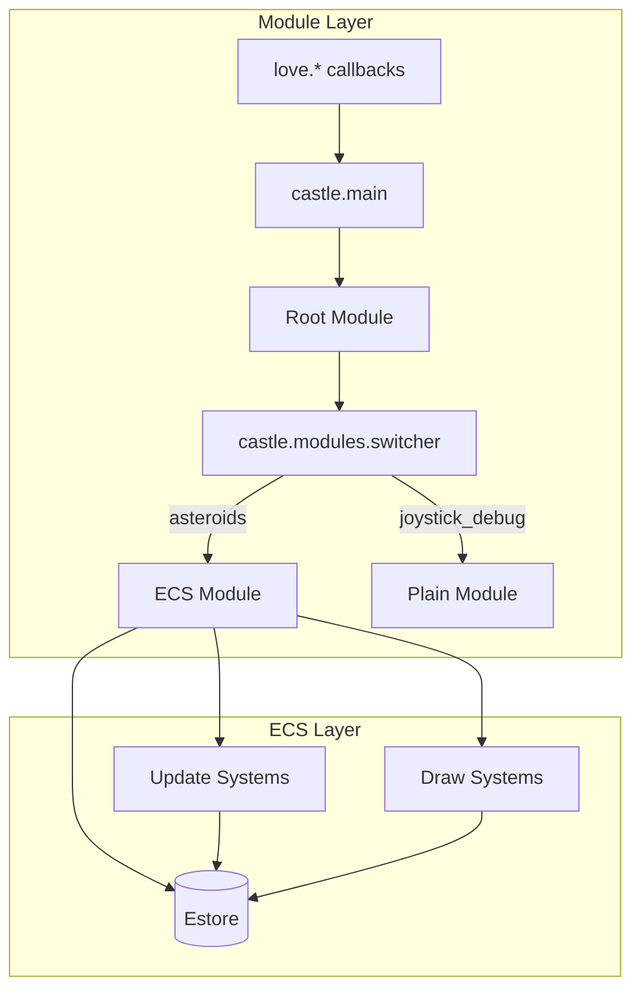

# Castle

Castle is the Love2D framework that lives in [`vendor/castle/`](../../vendor/castle). It is the substrate this project builds on — the user's own game engine, vendored alongside the game.

## The two layers

Castle is built around two concentric, composable layers:



| Layer | Purpose | Where |
|-------|---------|-------|
| **Module Layer** | Wraps Love2D's globals into pure-ish `world` state. Lets you compose, swap, and nest different "modes" of your game. | [`vendor/castle/main.lua`](../../vendor/castle/main.lua), [`vendor/castle/modules/`](../../vendor/castle/modules), [`vendor/castle/ecs/ecsadapter.lua`](../../vendor/castle/ecs/ecsadapter.lua) |
| **ECS Layer** | Entity/Component/System runtime. Holds game state in an `Estore`, runs systems each tick, draws via the scenegraph. | [`vendor/castle/ecs/`](../../vendor/castle/ecs), [`vendor/castle/components.lua`](../../vendor/castle/components.lua), [`vendor/castle/systems/`](../../vendor/castle/systems), [`vendor/castle/drawing/`](../../vendor/castle/drawing) |

Modules don't *require* the ECS layer — see [`modules/joystick_debug/init.lua`](../../modules/joystick_debug/init.lua) for a 50-line plain module. But the ECS layer is *exposed as* a Module via [`castle.ecs.ecsadapter`](../../vendor/castle/ecs/ecsadapter.lua), so once you wire up an ECS-backed module you can swap, nest, and switch it like any other.

## Reading order

| Doc | Topic |
|-----|-------|
| [modules.md](modules.md) | The Module Layer: lifecycle, switcher, ECS adapter, how Love2D events flow |
| [ecs.md](ecs.md) | The ECS Layer: Estore, Components, Entities, Queries, Systems |
| [resources.md](resources.md) | The declarative `resources.lua` pipeline (where modules + assets get configured) |
| [systems.md](systems.md) | Built-in systems and the scenegraph draw pipeline |
| [recipes.md](recipes.md) | Cookbook: defining components, systems, fire-and-forget effects, etc. |

## The 30-second tour

The whole runtime fits on one page:

```
main.lua                 ──> Castle = require "vendor/castle/main"
                              Castle.module_name = "modules/root"
                              Castle.onload      = setup window

vendor/castle/main.lua   ──> love.load   = loadItUp()      # boots ROOT module
                              love.update  = updateWorld()   # action = {type="tick", dt}
                              love.draw    = RootModule.drawWorld(world)
                              love.<input> = updateWorld({type=...})

modules/root.lua         ──> Switcher.newWorld({modules={asteroids=…, joystick_debug=…}})
                              F1/F2 swaps current

modules/asteroids/...    ──> GameModule.newFromFile("modules/asteroids/resources.lua")
                              ↳ resources.lua manifest is parsed by ResourceLoader
                              ↳ ECS module is wrapped via EcsAdapter
                              ↳ on first tick: estore is built; systems run; scenegraph draws
```

## Cross-cutting helpers

These are loaded once and live as **globals**:

- [`vendor/castle/helpers.lua`](../../vendor/castle/helpers.lua) — utility funcs: `tcopy`, `shallowclone`, `lmap/tmap`, `lfilter`, `lfindby`, `randomInt/Float`, `pickRandom`, `math.clamp`, `math.dist`, `math.rectanglesintersect`, `memoize0/1/2`, `makeFuncChain2`, `appendlist`, …
- [`vendor/castle/ecs/ecshelpers.lua`](../../vendor/castle/ecs/ecshelpers.lua) — ECS globals: `defineQuerySystem`, `defineQueryDrawSystem`, `hasTag/hasName/hasComps/allOf`, `tagEnt/nameEnt/selfDestructEnt`, `computeEntityTransform`, `screenToEntityPt`.
- `inspect`, `vector-light`, `mydebug`, `garbagecollect` — vendored standalone modules under `vendor/`.

If you find a function used without a `require`, look in those files.
