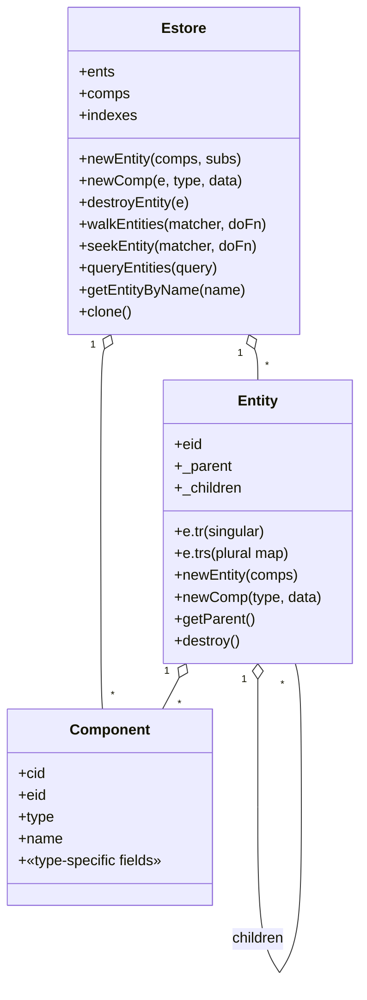

# The ECS Layer

Castle's ECS lives entirely under [`vendor/castle/ecs/`](../../vendor/castle/ecs). This is where game state lives once you're inside an `EcsAdapter`-wrapped module.

## Mental model

```
Estore
├── ents          eid -> Entity
├── comps         cid -> Component
├── _root._children  ──>  scene graph (parent/child tree of Entities)
├── indexes       byName, byTag, byCompType  (fast lookups)
└── caches        named caches for systems (e.g. physics worlds)
```



## Components

A **component** is a plain table with a registered type. Types are declared with `Comp.define`:

```lua
-- vendor/castle/components.lua:22
Comp.define("tr", { 'x',0, 'y',0, 'r',0, 'sx',1, 'sy',1, 'cx',0, 'cy',0 })
```

The trailing list is a `{name, default, name, default, …}` pair-list. From this castle creates:

- A type entry in `Comp.types[name]`.
- A pre-allocated **object pool** seeded with copies of the proto. ([component.lua:32](../../vendor/castle/ecs/component.lua#L32), [objpool.lua](../../vendor/castle/ecs/objpool.lua))
- `cleanCopy(data)` — pulls a prototype out of the pool, resets all fields to defaults, then merges `data` in. This is what `Estore:newComp` calls under the hood ([component.lua:56](../../vendor/castle/ecs/component.lua#L56)).
- Built-in fields every comp has: `cid`, `eid`, `type`, `name`. ([component.lua:75](../../vendor/castle/ecs/component.lua#L75))

Two components are special, defined in [`component.lua:126`](../../vendor/castle/ecs/component.lua#L126):

| Type | Use |
|------|-----|
| `parent` | Created automatically by `Entity:newChild` to wire up the parent/child tree. The parent's `eid` lives in `parent.parentEid`. |
| `name` | Lookup-by-name; the `name.name` field is what `byName` indexes on. |

The bulk of the framework's built-in component types are defined in one file: [`vendor/castle/components.lua`](../../vendor/castle/components.lua).

| Category | Components |
|---------|-----------|
| Common | `tag`, `tr`, `paralax`, `state`, `box`, `radius`, `timer`, `followable`, `follower` |
| Visuals | `viewport`, `bgcolor`, `pic`, `anim`, `rect`, `circle`, `label`, `sound`, `tween` |
| Physics | `physicsWorld`, `vel`, `body`, `force`, `joint`, `rectangleShape`, `circleShape`, `chainShape`, `polygonShape`, `polygonLineStyle`, `contact` |
| Input/UI | `keystate`, `button`, `touchable`, `touch`, `screen_grid` |

Module code can `Comp.define` more types ad-hoc. The asteroids module adds `health`, `cooldown`, `ship_controller` via the `components` block of [`modules/asteroids/resources.lua`](../../modules/asteroids/resources.lua) (see also [the data file](../../modules/asteroids/components.lua)). Drawing code does this too: `scenegraph_system2` defines `devgrid`, `devbg`, `tilingBackground` at module-load time ([scenegraph_system2.lua:46](../../vendor/castle/drawing/scenegraph_system2.lua#L46)).

### Component access shorthand on Entities

When you `addComp(e, comp)` ([estore.lua:140](../../vendor/castle/ecs/estore.lua#L140)) the estore wires up two refs on the entity:

```lua
e.tr        -- the singular: the FIRST comp of type "tr" added to e
e.trs       -- the plural map: { [name or cid] -> comp }
```

So:

```lua
ship.pic.sx        -- read shipping's first 'pic' component
ship.timers.flame  -- look up timer named "flame"
for _, t in pairs(ship.timers) do … end  -- iterate all timers
```

The plural key is `comp.name` if set, else `comp.cid`. This is why so many components carry a `name` field — it's the indirect handle to access them on an entity.

## Entities

[`Entity:new`](../../vendor/castle/ecs/entity.lua#L4) is just a thin wrapper around the table the estore stores in `self.ents[eid]`. Practically all entity construction goes through:

```lua
local e = estore:newEntity({
  { "name", { name = "ship" } },
  { "tr",   { x = 100, y = 100 } },
  { "pic",  { id = "ship_example_05", cx=0.5, cy=0.5 } },
})
```

The list is `{type, data}` pairs. Each `{type, data}` becomes a call to `Estore:newComp(e, type, data)` ([estore.lua:61](../../vendor/castle/ecs/estore.lua#L61)).

To attach a child entity:

```lua
local muzzle = ship:newEntity({
  { "tag", { name = "gun_muzzle_left" } },
  { "tr",  { x = -22, y = -9 } },
})
```

`Entity:newChild` ([entity.lua:36](../../vendor/castle/ecs/entity.lua#L36)) injects a `parent` component pointing at `self.eid`. The estore's `_linkEntityToParent` ([estore.lua:443](../../vendor/castle/ecs/estore.lua#L443)) then:

1. Sets `child._parent = self`.
2. Appends `child` to `self._children`.
3. Auto-assigns an order number, or uses the supplied `parent.order`.
4. Resorts siblings by order if needed.

Destruction recurses children-first ([estore.lua:81](../../vendor/castle/ecs/estore.lua#L81)).

### Walking the tree

| Method | What it does |
|--------|-------------|
| `walkEntities(matchFn, doFn)` | Preorder DFS from root, calling `doFn(e)` on each match. Return `false` from `doFn` to skip that subtree. |
| `walkEntity(e, …)` | Same but starting from a given entity. |
| `walkChildren(e, …)` | Children only, don't include `e` itself. |
| `walkEntities2(matchFn, doFn)` | Variant that passes a `descend` callback to `doFn`, letting you decide *when* to recurse — used by the older [scenegraph_system.lua](../../vendor/castle/drawing/scenegraph_system.lua) to `love.graphics.push/pop` around descent. |
| `seekEntity(matchFn, doFn)` | Same traversal but stops as soon as `doFn` returns `true`. |
| `seekEntityBottomUp` | Reverse-order — iterate children before parent, last-drawn first. Used by the touch system for hit-testing. |
| `findEntity(matchFn)` | Return first match or nil. |
| `getEntityByName(name)` | Indexed lookup; falls back to walk if not in `byName` index. |
| `getEntitiesByCompType(type)` | Indexed lookup of every entity that has a comp of given type. |
| `queryEntities(query)` / `queryFirstEntity` | Run a `Query` object. |

[`Estore` API summary on lines 254–429](../../vendor/castle/ecs/estore.lua#L254).

## Indexes

[`vendor/castle/ecs/indexer.lua`](../../vendor/castle/ecs/indexer.lua) maintains three indexes by default:

| Index | Key | Built from |
|-------|-----|------------|
| `byName` | the `name.name` of any `name` component | [indexer.lua:5](../../vendor/castle/ecs/indexer.lua#L5) |
| `byTag`  | the `tag.name` of any `tag` component    | [indexer.lua:5](../../vendor/castle/ecs/indexer.lua#L5) |
| `byCompType` | the comp's `type` field, for *all* types | [indexer.lua:8](../../vendor/castle/ecs/indexer.lua#L8) |

Indexes update incrementally as components are added/removed ([estore.lua:179](../../vendor/castle/ecs/estore.lua#L179), [estore.lua:212](../../vendor/castle/ecs/estore.lua#L212)).

## Queries

[`vendor/castle/ecs/query.lua`](../../vendor/castle/ecs/query.lua) is the ergonomic way to find entities. `Query.create(args)` accepts:

| Args type | Becomes |
|-----------|---------|
| `"sometype"` (string) | `byCompType` lookup for `sometype` |
| `function` | filter predicate |
| `{"a", "b", "c"}` (array of comp types) | byCompType on first, hasComps filter for the rest |
| `{ tag = "roid" }` | `byTag` lookup |
| `{ comp = "X" }` or `{ comps = {"A","B"} }` | byCompType + hasComps filter |
| `{ indexLookup = {name=, key=}, filter = fn }` | raw form |

```lua
-- modules/asteroids/jigs/test_flight.lua:22
local BulletQuery = Query.create({ tag = "ship_bullet" })

for _, bullet in ipairs(BulletQuery(estore)) do
  …
end
```

Queries are *callable*: `BulletQuery(estore)` is `BulletQuery:execute(estore)` (see the `__call` metamethod at [query.lua:33](../../vendor/castle/ecs/query.lua#L33)).

### Predicates

[`vendor/castle/ecs/predicates.lua`](../../vendor/castle/ecs/predicates.lua) ships the building blocks:

```lua
hasComps("tr", "pic")   -- returns fn(e) -> bool
hasTag("ship_bullet")
hasName("ship")
allOf(p1, p2, p3)
```

These are exposed as globals via [`ecshelpers.lua`](../../vendor/castle/ecs/ecshelpers.lua#L71) so you can use them anywhere without `require`.

## Systems

A **system** is `function(estore, input, res)` that runs once per tick.

The cleanest way to define one is `defineQuerySystem`:

```lua
-- ecshelpers.lua:98
function defineQuerySystem(queryArgs, fn)
  local query = Query.create(queryArgs)
  return function(estore, input, res)
    local ents = query(estore)
    for i = 1, #ents do
      fn(ents[i], estore, input, res)
    end
  end
end
```

Example — the cooldown system from this project:

```lua
-- modules/asteroids/systems/cooldown.lua:40
Cooldown.system = defineQuerySystem(
  "cooldown",
  function(e, estore, input, res)
    for _, cooldown in pairs(e.cooldowns) do
      local timer = e.timers and e.timers[cooldown.name]
      if cooldown.state == COOLDOWN and timer and timer.alarm then
        _reset(e, cooldown, timer)
      end
    end
  end
)
```

Older systems use `defineUpdateSystem(matchSpec, fn)` which uses a predicate instead of an indexed query ([ecshelpers.lua:79](../../vendor/castle/ecs/ecshelpers.lua#L79)). Both are fine; query-based is faster for big estores.

A system can also be a table with one of `system`, `updateSystem`, or `System` keys, or a constructor key `new`/`newSystem`/`newUpdateSystem`. `resolveSystem` ([ecshelpers.lua:17](../../vendor/castle/ecs/ecshelpers.lua#L17)) figures it out.

### Composing systems

`composeSystems(list, res)` ([ecshelpers.lua:38](../../vendor/castle/ecs/ecshelpers.lua#L38)) reduces a list of system specs into a single `function(estore, input, res)` that calls each in order.

The asteroids module wires its systems list declaratively in [`resources.lua`](../../modules/asteroids/resources.lua):

```lua
systems = {
  data = {
    "castle.systems.timer",
    "castle.systems.selfdestruct",
    "castle.systems.anim",
    "castle.systems.physics",
    "castle.systems.follower",
    "castle.systems.sound",
    "castle.systems.touch",
    "castle.systems.touchbutton",
    "castle.systems.tween",
    "castle.systems.keystate",
    "castle.systems.controller_state",
    "modules.asteroids.systems.cooldown",
    "modules.asteroids.systems.camera_dev_system",
    "modules.asteroids.systems.ship_controller",
    "modules.asteroids.systems.boxthinger",
  }
},
```

Order matters. Notable ordering pattern: input systems (`keystate`, `controller_state`) run *after* gameplay systems but before drawing — see [`systems.md`](systems.md) for the full breakdown. Actually looking again — they're at the end of the update list because the gameplay systems above consume the *previous* tick's keystate. (See [`keystate.lua`](../../vendor/castle/systems/keystate.lua) which resets `pressed` at the start of its update.)

## Putting it all together: the EcsAdapter spec

What `GameModule.newFromFile` ([gamemodule.lua:34](../../vendor/castle/ecs/gamemodule.lua#L34)) ultimately produces is this `ecsArgs` table for [`ecsadapter.lua`](../../vendor/castle/ecs/ecsadapter.lua#L147):

```lua
{
  name          = "main",
  create        = entities.initialEntities,   -- (res) -> estore
  update        = composedSystems,            -- (estore, input, res)
  draw          = composedDrawSystems,        -- (estore, res)
  loadResources = function() return res end,
}
```

`create(res)` is the function in [`modules/asteroids/entities.lua`](../../modules/asteroids/entities.lua) that returns the initial Estore:

```lua
function E.initialEntities(res)
  local w, h = love.graphics.getDimensions()
  res:get("data"):put("screen_size", { width = w, height = h })
  local estore = Estore:new()
  SceneBased.populate(estore, res)
  return estore
end
```

That `Estore:new()` plus `populate` is where your scene tree gets seeded. From there each tick:

1. `castle.main` synthesizes a `tick` action.
2. `Switcher` forwards it to current child.
3. `EcsAdapter.doTick` calls `update(estore, input, res)` which is the composed list of systems.
4. After update, `EcsAdapter.drawWorld` calls `draw(estore, res)` which is the composed list of draw systems — usually exactly one: [`castle.drawing.scenegraph_system2`](../../vendor/castle/drawing/scenegraph_system2.lua).

## State component helpers

For convenience there's [`vendor/castle/state.lua`](../../vendor/castle/state.lua) — a thin wrapper around the `state` component (which has just `{value}` field):

```lua
State.get(e, "selected")          -- read
State.set(e, "selected", 3)       -- write
State.toggle(e, "debug_draw")     -- bool flip
```

## Cloning, history, the editor

`Estore:clone(opts)` ([estore.lua:541](../../vendor/castle/ecs/estore.lua#L541)) makes a deep copy of the entire estore — components are pulled from object pools, parent/child structure is rebuilt, sibling order is preserved. The editor's history stack uses this each tick when recording is on.

## Cheat-sheet

| You want to… | Do this |
|---|---|
| Define a new component type | `Comps.define("name", { 'field', default, … })` |
| Build an entity with components | `parent:newEntity({ {"tr",{}}, {"pic", {id="x"}} })` |
| Add a component later | `e:newComp("type", { data })` |
| Remove a component | `e:removeComp(e.someComp)` |
| Destroy the entity | `e:destroy()` |
| Self-destruct after N seconds | `selfDestructEnt(e, 0.5)` |
| Find by name | `estore:getEntityByName("ship")` |
| Find first by tag | `estore:queryFirstEntity(Query.create({tag="roid"}))` |
| Walk all of type | `estore:walkEntities(hasComps("body"), fn)` |
| Build a system | `return defineQuerySystem({tag="ship_bullet"}, fn)` |
| Get global transform | `computeEntityTransform(e)` (or `…2` from scenegraph_system2) |
| Read/write `state` value | `State.get/set(e, name, value)` |
