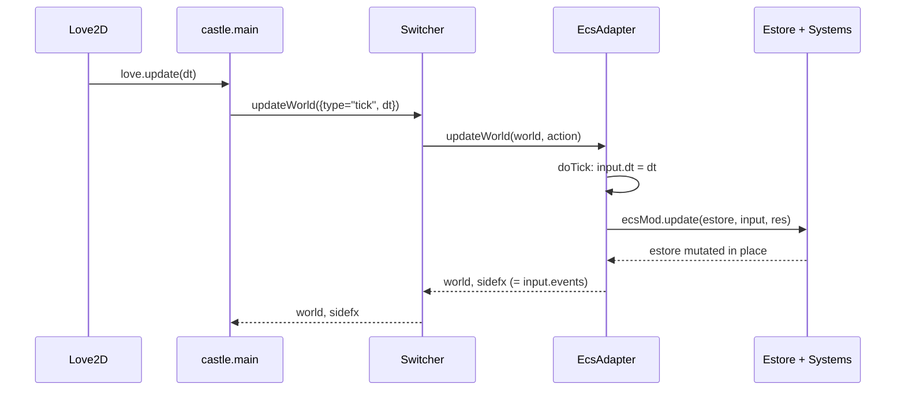

# The Module Layer

A **Module** is the top-level unit of state-management in castle. The official contract — see [`vendor/castle/modules/README_modules.md`](../../vendor/castle/modules/README_modules.md) — is three functions:

```lua
M.newWorld(opts)            -> world
M.updateWorld(world, action) -> world, sidefx?
M.drawWorld(world)
```

Rules:

1. **The Module owns no state.** All state lives in `world`, which is created by `newWorld` and only mutated through `updateWorld`.
2. **`updateWorld` is the only mutator.** It's pure-ish: take `(world, action)`, return `(newWorld, sidefx)`. The caller decides what to do with `world` next tick.
3. **`world` shape is private** to the module. Different modules represent it however they like (table, immutable record, ECS world, etc.).
4. **Any valid `world` may be passed at any time** — the module must be re-entrant.

This is loosely modeled on Elm's `(model, msg) -> (model, Cmd)` pattern.

## Where Love2D meets Castle

[`main.lua`](../../main.lua) at the project root is tiny:

```lua
local Castle = require "vendor/castle/main"
Castle.module_name = "modules/root"
Castle.onload = function()
  love.window.setMode(1024, 768, { resizable=true, highdpi=true })
end
```

[`vendor/castle/main.lua`](../../vendor/castle/main.lua) attaches every Love2D global callback. Each callback builds an `action` and calls `updateWorld(action)`. The module never sees raw Love2D events:

| Love2D callback | castle.main location | Action emitted |
|-----------------|----------------------|-----------------|
| `love.load`         | [main.lua:104](../../vendor/castle/main.lua#L104) | (boots — calls `loadItUp`) |
| `love.update(dt)`   | [main.lua:138](../../vendor/castle/main.lua#L138) | `{type="tick", dt}` |
| `love.draw`         | [main.lua:154](../../vendor/castle/main.lua#L154) | (calls `RootModule.drawWorld`) |
| `love.keypressed`   | [main.lua:207](../../vendor/castle/main.lua#L207) | `{type="keyboard", state="pressed", key, ctrl/shift/gui flags}` |
| `love.keyreleased`  | [main.lua:211](../../vendor/castle/main.lua#L211) | `{type="keyboard", state="released", …}` |
| `love.mousepressed/released/moved` | [main.lua:247](../../vendor/castle/main.lua#L247) | `{type="mouse", state, x, y, button, isTouch, dx, dy}` |
| `love.touchpressed/moved/released` | [main.lua:278](../../vendor/castle/main.lua#L278) | `{type="touch", state, id, x, y, dx, dy}` |
| `love.joystickaxis/pressed/released` | [main.lua:320](../../vendor/castle/main.lua#L320) | `{type="joystick", joystickId, instanceId, controlType, control, value, controlName, controlMap}` |
| `love.textinput`    | [main.lua:337](../../vendor/castle/main.lua#L337) | `{type="textinput", text}` |
| `love.resize`       | [main.lua:341](../../vendor/castle/main.lua#L341) | `{type="resize", w, h}` |

### sidefx

`updateWorld` may return a second value: a list of side-effect signals. `castle.main` handles two:

- `{type="castle.reloadRootModule"}` → re-`require`s the root module after uncaching its dependency tree (built-in hot reload, see below).
- `{type="castle.toggleDebugLog"}` → flips an internal flag.

A module can return *anything* in `sidefx`; only these two reach `castle.main`. Most code uses sidefx as a way for inner modules (e.g. the switcher's children) to signal upward.

## Hot reloading

[`vendor/castle/moduleloader.lua`](../../vendor/castle/moduleloader.lua) hooks `require` to record a dependency tree as modules load:

- [moduleloader.lua:36](../../vendor/castle/moduleloader.lua#L36) — wraps the global `require`, pushing/popping a stack so each module records what it loaded.
- [moduleloader.lua:60](../../vendor/castle/moduleloader.lua#L60) — `list_deps_of(name)` returns every transitive dep.
- [moduleloader.lua:68](../../vendor/castle/moduleloader.lua#L68) — `uncache_package(name)` is a one-line `package.loaded[name] = nil`.

When `castle.main` receives `{type="castle.reloadRootModule"}` it walks the dep tree, uncaches everything, and calls `loadItUp()` again — rebuilding `world` from scratch. Default trigger: <kbd>cmd</kbd>+<kbd>r</kbd> (the `gui+r` keystroke is intercepted by `castle.ecs.ecsadapter`, see below).

## Composing modules: the Switcher

[`vendor/castle/modules/switcher.lua`](../../vendor/castle/modules/switcher.lua) is itself a Module that contains other Modules. Its `world` is `{instances, current}`.

```lua
-- modules/root.lua
local Switcher = require('castle.modules.switcher')
local GM = require('castle.ecs.gamemodule')

local ModuleMap = {
  asteroids = GM.newFromFile("modules/asteroids/resources.lua"),
  joystick_debug = require("modules/joystick_debug")
}

function M.newWorld()
  return { switcher = Switcher.newWorld({ modules = ModuleMap, current = "asteroids" }) }
end
```

Key behaviors:

- Children are **lazy-instantiated** via `memoize0`. The `joystick_debug` module's world is never built unless you switch to it. ([switcher.lua:13](../../vendor/castle/modules/switcher.lua#L13))
- A `{type="castle.switcher", index="…"}` action flips `current`. ([switcher.lua:25](../../vendor/castle/modules/switcher.lua#L25))
- Once switched, only the `current` module receives updates and draws. The other module's `world` is paused-in-place (still in memory).

`modules/root.lua` listens for F1/F2 and synthesizes the switcher action:

```lua
ifKeyPressed(action, "f1", function()
  action = { type = "castle.switcher", index = "asteroids" }
end)
```

## ECS as a Module: the EcsAdapter

[`vendor/castle/ecs/ecsadapter.lua`](../../vendor/castle/ecs/ecsadapter.lua) wraps an "ECS module" (`{name, create, update, draw, loadResources}`) into a regular castle Module. This is how the asteroids game gets in.



Inside [`ecsadapter.lua` updateWorld](../../vendor/castle/ecs/ecsadapter.lua#L51):

| Action handled | Effect |
|---------------|--------|
| `tick` | runs `doTick` if not paused; if editor open, refreshes editor |
| `keyboard` (gui+r) | emits `castle.reloadRootModule` sidefx |
| `keyboard` (escape) | toggles `world.editor.on` (and pauses) |
| `keyboard` (other) | appended to `world.input.events` |
| `mouse` (not isTouch) | converted to a `touch` event with id `"mousetouch1"` (so desktop and touch use the same touch system) |
| `touch` | appended verbatim |
| `joystick` | piped through `JoystickAdapter.appendControllerEvents` ([joystickadapter.lua:42](../../vendor/castle/ecs/joystickadapter.lua#L42)) which emits `controller`-type events keyed by `controllerId="joystick1"` |
| `textinput` | dispatched to the editor |

[`ecsadapter.lua` doTick:33](../../vendor/castle/ecs/ecsadapter.lua#L33) is where the ECS update actually fires:

```lua
local function doTick(ecsMod, world, action)
  world.input.dt = action.dt
  ecsMod.update(world.estore, world.input, world.resources)
  local sidefx = world.input.events  -- events propagate up as sidefx
  world.input.dt = 0
  world.input.events = {}
  …
end
```

The `world.input` table is the "tick context" given to every system — `dt`, accumulated `events`. Systems consume events by calling `EventHelpers.handle(input.events, …)` ([eventhelpers.lua](../../vendor/castle/systems/eventhelpers.lua)).

## Built-in editor

[`ecsadapter.lua:60`](../../vendor/castle/ecs/ecsadapter.lua#L60) shows that **escape** toggles a SUIT-based debug editor. While open the `world` is paused; if `world.editor.recording` is on, [`doTick:42`](../../vendor/castle/ecs/ecsadapter.lua#L42) clones the estore each tick into `world.editor.history` so you can scrub. The implementation lives in [`vendor/castle/ecs/editorgui.lua`](../../vendor/castle/ecs/editorgui.lua).

## Writing a plain Module

A non-ECS module is just a 50-line file. [`modules/joystick_debug/init.lua`](../../modules/joystick_debug/init.lua):

```lua
local M = {}

function M.newWorld()
  return { tracker = {} }
end

function M.updateWorld(w, action)
  if action.state == 'pressed' and action.key == 'r' and action.gui then
    return w, { { type = "castle.reloadRootModule" } }
  end
  if action.type == "joystick" then
    local key = action.name .. " " .. action.controlType .. " " .. tostring(action.control)
    w.tracker[key] = action.value
  end
  return w
end

function M.drawWorld(w)
  love.graphics.print("Joystick Debug")
  love.graphics.print(renderValues(w.tracker), 50, 50)
end

return M
```

That's it. `castle.main` doesn't care that this module skipped ECS, resources, scenegraph, etc.

## Module-Layer entry points cheat-sheet

| Symbol | File:Line | What it does |
|--------|-----------|--------------|
| `Castle.module_name`, `Castle.onload` | [main.lua:3](../../main.lua#L3) | Project bootstrap: name a root module, configure window |
| `Castle.module` (alternative) | [main.lua:53](../../vendor/castle/main.lua#L53) | Pass an already-loaded module table instead of a path |
| `loadItUp()` | [main.lua:48](../../vendor/castle/main.lua#L48) | Resolves and instantiates the root module |
| `reloadRootModule()` | [main.lua:82](../../vendor/castle/main.lua#L82) | Hot-reload entry point |
| `setErrorMode()` | [main.lua:34](../../vendor/castle/main.lua#L34) | Captures errors → red error screen + 'r' to reload |
| `Switcher.newWorld({modules=…, current=…})` | [switcher.lua:5](../../vendor/castle/modules/switcher.lua#L5) | Build a multiplexer module |
| `GameModule.newFromFile(path)` | [gamemodule.lua:34](../../vendor/castle/ecs/gamemodule.lua#L34) | Build an ECS-backed module from a resources manifest |
| `EcsAdapter(ecsArgs)` | [ecsadapter.lua:147](../../vendor/castle/ecs/ecsadapter.lua#L147) | Lower-level: wrap an arbitrary ECS module spec |
