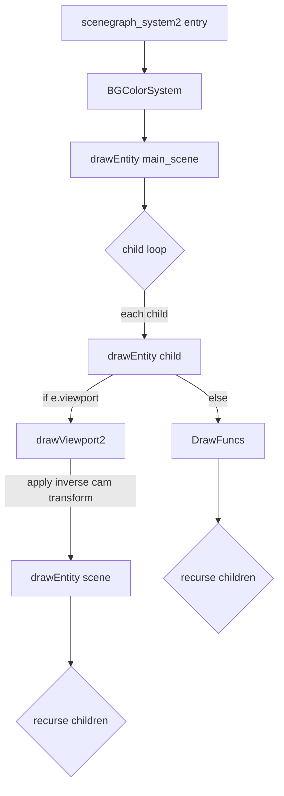

# Built-in Systems & the Draw Pipeline

This is a tour of every system castle ships under [`vendor/castle/systems/`](../../vendor/castle/systems) and [`vendor/castle/drawing/`](../../vendor/castle/drawing). Each section explains the system's input components, what it does each tick, and any notable side effects.

## Update systems

Order matters; the asteroids module wires them in this sequence ([resources.lua](../../modules/asteroids/resources.lua)):

```
timer  ─┐
selfdestruct ─┐
anim ─┐
physics ─┐                "world" simulation
follower ─┐
sound ─┐
touch ─┐
touchbutton ─┐            "io" capture
tween ─┐
keystate ─┐
controller_state ─┘
+ project-specific systems (cooldown, ship_controller, etc.)
```

### timer
[`vendor/castle/systems/timer.lua`](../../vendor/castle/systems/timer.lua)

Every entity with a `timer` component has each timer ticked. Two modes:

| `countDown=true` (default) | counts `t` down from initial value to 0 |
| `countDown=false` | counts `t` up; if `reset > 0`, alarms when `t >= reset`, then loops or clamps |

When time elapses, `timer.alarm = true` is set. If `timer.event` was set, an event is appended to `input.events` ([timer.lua:1](../../vendor/castle/systems/timer.lua#L1)). The `factor` field scales `dt` (so you can speed up/slow down individual timers, used for animations).

### selfdestruct
[`vendor/castle/systems/selfdestruct.lua`](../../vendor/castle/systems/selfdestruct.lua)

Two-line system. Runs on entities tagged `self_destruct` *and* having a `timer.self_destruct`. When that timer alarms, the entity is destroyed. Pair with the helper:

```lua
selfDestructEnt(e, 0.5)  -- ecshelpers.lua:176
```

which adds the tag and a 0.5-second timer.

### anim
[`vendor/castle/systems/anim.lua`](../../vendor/castle/systems/anim.lua)

For each entity that has both `anim` and `timer` components:

- Lazy-fills `anim.duration` from `res.anims:get(anim.id).duration`.
- If `anim.timer == ''`, defaults the timer name to the anim's name.
- If `anim.onComplete == "selfDestruct"` → destroys the entity once `timer.t > duration`.
- If `anim.onComplete == "expire"` → removes the anim and timer comps but leaves the entity.

The actual frame picking happens in [`draw_anim_entities`](../../vendor/castle/drawing/draw_anim_entities.lua) at draw time using `animRes.getFrame(timer.t)`.

### physics
[`vendor/castle/systems/physics.lua`](../../vendor/castle/systems/physics.lua) (it's bigger; only highlights here)

Wraps Love2D's Box2D physics. The system runs on each entity carrying a `physicsWorld` component (you typically have one in the world).

Each tick:

1. Sync component values → physics objects (sets position, angle, velocities, applies forces/impulses, then zeroes impulses).
2. Step the physics world (`world:update(dt)`).
3. Sync physics objects → component values (read back position/angle into `tr`, velocity into `vel`).
4. Beginnings/endings of contacts produce `contact` components that get attached to entities (used by gameplay code like [`battle_helpers.bulletHitsRoid`](../../modules/asteroids/battle_helpers.lua) to react to collisions).

Components used: `physicsWorld`, `body`, `vel`, `force`, `circleShape`/`rectangleShape`/`polygonShape`/`chainShape`, `joint`, `contact` (output).

### follower
[`vendor/castle/systems/follower.lua`](../../vendor/castle/systems/follower.lua)

Marked TODO. Currently: an entity with a `follower` comp and a `tr` will copy `tr.x/tr.y` from the *first* entity that has both `followable` and `tr` *and* whose `followable.targetname == follower.targetname`. Used for the camera-follows-ship pattern.

### sound
[`vendor/castle/systems/sound.lua`](../../vendor/castle/systems/sound.lua)

Tracks `sound`-component playtime, removing one-shot sounds when their `duration` is exhausted. Music sounds (`music=true`) and looping sounds persist indefinitely. Backfills `duration` from the loaded sound resource if not pre-set.

The actual *playback* is driven by [`vendor/castle/drawing/draw_sound_entities.lua`](../../vendor/castle/drawing/draw_sound_entities.lua), which calls into the [`vendor/castle/soundmanager.lua`](../../vendor/castle/soundmanager.lua) singleton. Soundmanager `manage(key, source)` is called each draw to "ping" alive sounds; `cleanup()` (called from [`castle.main:165`](../../vendor/castle/main.lua#L165)) stops un-pinged sounds.

### touch
[`vendor/castle/systems/touch.lua`](../../vendor/castle/systems/touch.lua)

Consumes `touch`-type events from `input.events`. Three handlers:

- **pressed**: `seekEntityBottomUp` for an entity with `touchable` whose hit-circle (`x,y,r`) the touch point falls inside; attaches a fresh `touch` component to it.
- **moved**: locates the existing touch by id, updates position.
- **released**: marks the touch as `released`; the next tick will remove it.

`screenToEntityPt(e, x, y)` ([ecshelpers.lua:277](../../vendor/castle/ecs/ecshelpers.lua#L277)) inverse-transforms the screen coords into the entity's local space using `computeEntityTransform`. This is how a child entity in a viewport-camera scene receives correctly-localized touches.

### touchbutton
[`vendor/castle/systems/touchbutton.lua`](../../vendor/castle/systems/touchbutton.lua)

When a `touch` and `button` co-exist on an entity:

- For `button.kind == 'hold'`: starts a `holdbutton` timer on press; if the timer alarms before release, emits `{type=button.eventtype, state=button.eventstate, eid, cid}` into `input.events`.
- "tap" buttons are TODO in the current code.

### tween
[`vendor/castle/systems/tween.lua`](../../vendor/castle/systems/tween.lua)

One-liner: for each `tween` component, calls `Tween.apply(e)` which uses the entity's referenced timer (`tween.timer`) to interpolate `e[comp][prop]` from `tween.from` to `tween.to` with the named easing.

The convenience constructor is [`TweenHelpers`](../../vendor/castle/tween/tween_helpers.lua):

```lua
TweenHelpers.tweenit(camera, "zoom",
  { tr = { sx = 2.0, sy = 2.0 } },
  { duration = 0.5, easing = "outQuint" })
```

`addTweens` ([tween_helpers.lua:5](../../vendor/castle/tween/tween_helpers.lua#L5)) cleans up any existing timer of the same name plus tweens that referenced it, then registers new ones for each comp/prop pair.

### keystate
[`vendor/castle/systems/keystate.lua`](../../vendor/castle/systems/keystate.lua)

For each entity with a `keystate` component:

1. Clears `pressed` and `released` from last tick.
2. Iterates `input.events` for `keyboard` events. For each press/release:
   - If `keystate.handle` doesn't list this key, the event is *not* consumed (passed through to other handlers).
   - Otherwise update `keystate.pressed/held/released`. If `keystate.consume == true`, also remove the event so downstream systems don't see it.

Components see the result as `e.keystate.pressed.up`, `e.keystate.held.space`, etc.

### controller_state
[`vendor/castle/systems/controller_state.lua`](../../vendor/castle/systems/controller_state.lua)

Same idea for `controller`-type events. The component carries a `match_id` (e.g. `"joystick1"`) — only events matching get applied. Output keys: `value` (current axis values), `pressed`, `held`, `released` (each keyed by the action name like `face1`/`leftx`).

The mapping from raw `joystick`-type events to `controller`-type events happens in [`ecsadapter.lua:106`](../../vendor/castle/ecs/ecsadapter.lua#L106) → [`joystickadapter.lua:42`](../../vendor/castle/ecs/joystickadapter.lua#L42) using a layout from [`vendor/castle/joystick.lua`](../../vendor/castle/joystick.lua) (PS4 mapping is built-in).

## Helper: EventHelpers

[`vendor/castle/systems/eventhelpers.lua`](../../vendor/castle/systems/eventhelpers.lua) is the canonical pattern for consuming events:

```lua
EventHelpers.handle(input.events, "keyboard", {
  pressed = function(evt) … end,
  released = function(evt) … end,
})

EventHelpers.handleKeyPresses(input.events, {
  ["space"] = function(evt) fireWeapon() end,
  ["q"]     = function(evt) quit() end,
})
```

Returning `false` from a handler keeps the event in the queue; otherwise it's consumed.

## The Draw Pipeline

Drawing is a separate composition of "draw systems" — same shape as update systems but they take `(estore, res)` instead of `(estore, input, res)`.

The asteroids module uses exactly one draw system: [`castle.drawing.scenegraph_system2`](../../vendor/castle/drawing/scenegraph_system2.lua).

### scenegraph_system2

Walks the scene graph recursively from the entity named `"main_scene"`:

```lua
-- scenegraph_system2.lua:357
return function(estore, res)
  BGColorSystem(estore, res)
  local main_scene = estore:getEntityByName("main_scene")
  drawEntity(main_scene, res)
end
```

`drawEntity(e, res, viewportEnt)` ([scenegraph_system2.lua:262](../../vendor/castle/drawing/scenegraph_system2.lua#L262)):

1. Computes the entity's full transform via [`computeEntityTransform2`](../../vendor/castle/drawing/scenegraph_system2.lua#L81), which:
   - Recurses up the parent chain, accumulating `tr` into a Love2D `Transform`.
   - If the entity has a `paralax` comp *and* a viewport context, modifies the transform via `applyParalax`.
2. `love.graphics.push()` and applies the transform.
3. If the entity has a `viewport` comp, calls `drawViewport2` to render its scene-by-name.
4. Runs the registered `DrawFuncs` against the entity.
5. Recurses into each child.
6. `love.graphics.pop()`.

`drawViewport2` ([scenegraph_system2.lua:307](../../vendor/castle/drawing/scenegraph_system2.lua#L307)):

- Optionally fills the viewport's box with `bgcolor` (if `use_bgcolor`).
- Optionally stencils drawing inside the box (`blockout`).
- Looks up the camera by name; if found, applies its **inverse** transform so the world is rendered relative to the camera.
- Recursively draws the named scene entity.



### Built-in DrawFuncs

[`scenegraph_system2.lua:210`](../../vendor/castle/drawing/scenegraph_system2.lua#L210) registers these in order:

| File | Draws |
|------|-------|
| [`draw_screengrid_entity.lua`](../../vendor/castle/drawing/draw_screengrid_entity.lua) | `screen_grid` debug grid |
| [`draw_pic_entities.lua`](../../vendor/castle/drawing/draw_pic_entities.lua) | every `pic` component on the entity |
| [`draw_anim_entities.lua`](../../vendor/castle/drawing/draw_anim_entities.lua) | every `anim`, looking up the current frame from the linked timer |
| [`draw_geom_entities.lua`](../../vendor/castle/drawing/draw_geom_entities.lua) | `box` (debug only), `rect`, `circle`, `radius` (debug only) |
| [`draw_button_entities.lua`](../../vendor/castle/drawing/draw_button_entities.lua) | hold-button progress visuals |
| [`draw_physics_entities.lua`](../../vendor/castle/drawing/draw_physics_entities.lua) | physics body/shape outlines (debug only) |
| [`draw_label_entities.lua`](../../vendor/castle/drawing/draw_label_entities.lua) | text labels |
| [`draw_sound_entities.lua`](../../vendor/castle/drawing/draw_sound_entities.lua) | not actually visual — pings the soundmanager to keep the sound alive |
| [`draw_touch_debugs.lua`](../../vendor/castle/drawing/draw_touch_debugs.lua) | touch debug overlays |
| `drawDevGrid` (inline) | `devgrid` debug dots/coords |
| `drawDevBg` (inline) | `devbg` viewport-aabb-clipped colored tile grid |
| `drawTilingBackground` (inline) | `tilingBackground` — tiled `pic` covering the visible viewport |

All `pic`-and-`anim`-style draws funnel through [`drawPicLike`](../../vendor/castle/drawing/draw_piclike.lua), which honors `cx/cy/sx/sy/color` and renders the entity's `picRes.image`+`picRes.quad`.

### Parallax, Tiling, and viewport AABBs

The new draw pipeline introduces three viewport-aware tricks, all in `scenegraph_system2.lua`:

#### 1. `paralax` component
Fields: `px, py` (defaults 1, 1).

| `px,py` | Meaning |
|--------|---------|
| `1, 1` | Locked to camera (HUD-like) |
| `0.5, 0.5` | Half-speed parallax — appears to move slowly relative to world |
| `0, 0` | Same as no parallax — moves with world |
| `-1, -1` | Inverse parallax (parallax-anti-camera, looks weird, exists) |

Applied in [`applyParalax` at line 232](../../vendor/castle/drawing/scenegraph_system2.lua#L232). It computes how far the camera is from the entity in the entity's transform context, then translates the transform back toward the camera by `paralax.{px,py} * (camDelta) * 0.5`.

> **Caution**: there's a hard-coded `mysterious_correction = 0.5` factor that the author has flagged as unexplained. Likely an artifact of the camera's inverse transform being applied at the viewport boundary. Investigate before adjusting.

#### 2. `tilingBackground` component
Combined with a `pic` and (optionally) a `paralax`, this entity tiles its image to cover the viewport's visible area in entity-local space:

```lua
-- modules/asteroids/entities/scene_based.lua:64
space_bg:newEntity({
  { "tilingBackground", {} },
  { "pic",              { id = "nebula_blue" } },
  { "paralax",          { px = 0.25, py = 0.25 } },
})
```

`drawTilingBackground` ([scenegraph_system2.lua:188](../../vendor/castle/drawing/scenegraph_system2.lua#L188)) computes the viewport's AABB transformed into entity-local coordinates, then iterates only the tiles intersected by that AABB.

#### 3. `devgrid` and `devbg` debug components
Same machinery (`getViewportAABB` + `getIntersectingTileRangeAABB`) used to draw a coordinate-labeled grid or a colored rectangle pattern, useful for debugging camera/parallax math.

### Older drawing system (deprecated)

[`vendor/castle/drawing/scenegraph_system.lua`](../../vendor/castle/drawing/scenegraph_system.lua) is the previous draw pipeline. It uses `walkEntities2`, treats viewports specially via `withStencil` + `withViewportCameraTransform`, and computes parallax via `computeLocWithParalax`. **Do not use it** — its `findOwningViewportCamera` dependency now throws "DECOMMISSIONED" ([viewport_helpers.lua:7](../../vendor/castle/ecs/viewport_helpers.lua#L7)). New code should target `scenegraph_system2`.

## Quick reference: choosing a system pattern

| You want… | Use this |
|---|---|
| Run logic on every entity that has comp X | `defineQuerySystem("X", fn)` |
| …or specifically tagged | `defineQuerySystem({tag="foo"}, fn)` |
| Run logic on entities with comp A AND comp B | `defineQuerySystem({"A","B"}, fn)` |
| Hand-roll a system | `return function(estore, input, res) … end` (just a plain function) |
| Trigger code N seconds from now | `e:newComp("timer", {name="x", t=N, event={type="…"}})` |
| Self-destruct in N | `selfDestructEnt(e, N)` |
| Tween a value | `TweenHelpers.tweenit(e, "name", { tr = { x = 100 } })` |
| Read keys | put `keystate { handle = {"a","b"} }` on an entity |
| Read controller | put `controller_state { match_id = "joystick1" }` on an entity |
| Consume events directly | `EventHelpers.handle(input.events, "keyboard", {pressed=…, released=…})` |
